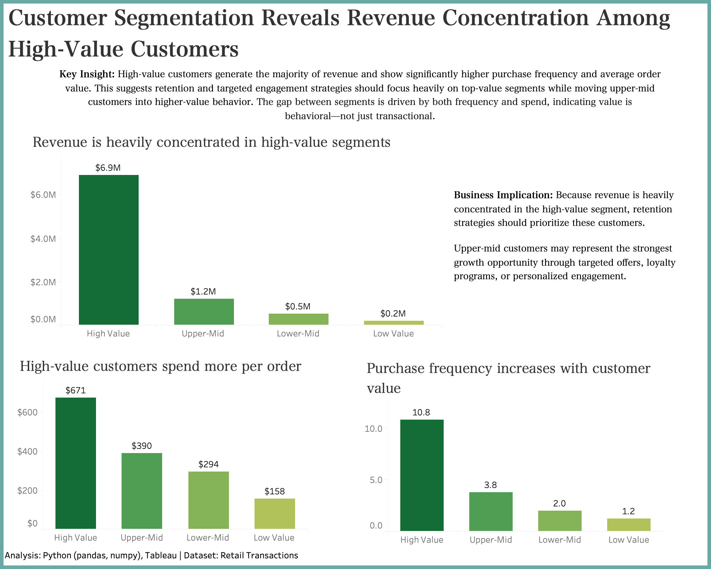

# Luxury Customer Behavior Analysis
This project analyzes transactional retail data to identify high-value customer segments, quantify revenue concentration, and uncover the key behavioral drivers behind customer value.

## Overview
The objective of this analysis was to determine how revenue is distributed across customers and to understand what differentiates high-value customers from the rest of the customer base.

Key areas of focus include:
- Revenue concentration across customer segments
- Behavioral differences by segment
- Purchase frequency and repeat behavior
- Average order value (AOV) as a driver of customer value

## Tools & Technologies
- Python (pandas, numpy, matplotlib)
- Jupyter Notebook
- Tableau (dashboard development and visualization)

## Data Preparation
- Standardized column naming conventions for consistency
- Removed incomplete records (missing customer IDs)
- Created a revenue metric (Quantity × Price)
- Validated and corrected data types for analysis

## Customer-Level Analysis
Transaction-level data was aggregated to the customer level to calculate:
- Total revenue per customer
- Purchase frequency
- Average order value

This enabled a shift from transactional reporting to customer-centric analysis, allowing for more meaningful segmentation and insights. 

## Customer Segmentation
Customers were segmented into quartiles based on total revenue:
- Low Value
- Lower-Mid
- Upper-Mid
- High Value

This segmentation framework enabled direct comparison of behavior and contribution across customer groups. 

## Key Insights
### Revenue Concentration
A small proportion of customers drives a disproportionate share of revenue. The top ~10% of customers contribute approximately 60% of total revenue, highlighting a highly concentrated revenue distribution. 

### Behavioral Drivers of Value
High-value customers exhibit:
- Significantly higher purchase frequency
- Substantially higher average order value

These two factors are the primary drivers separating top-tier customers from the rest. 

### Segment Contribution Imbalance
Although customers are evenly distributed across segments, revenue contribution is not. The highest-value segment generates the majority of total revenue, while lower-value segments contribute minimally. 

## Business Implications
- Retention is critical: Losing high-value customers would have a disproportionate impact on revenue
- Early engagement matters: Improving the initial customer experience can increase repeat purchases
- Growth opportunity exists in mid-tier segments: Targeted strategies can move customers into higher-value tiers
- Personalization and loyalty strategies can increase frequency and spend

## Deliverables
- Jupyter Notebook containing full analysis and methodology
- Tableau dashboard showcasing revenue concentration and behavioral segmentation

## Tableau Dashboard

The dashboard visualizes revenue concentration, average order value, and purchase frequency by customer segment to highlight the behavioral drivers of customer value. 
